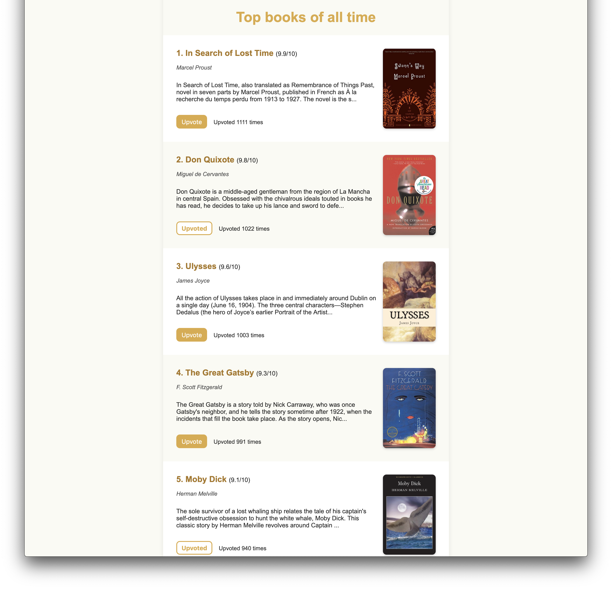

# Front end Engineer Challenge

Submit all the answers by creating a **private** GitHub repository and sharing it with **reedsyapplications**. Alternatively, you can submit a zipped folder with all the answers.
Your submission should include markdown and code and each answer should be in it's own folder.

The estimated time to accomplish every task sits between 10 and 15 hours, depending on your experience.


## 1. About you

##### I am currently working on it it's 90% developed already. it's an e-commerce headless in Vue.js
##### The unique thing about this project is it's not normal e-commerce which has simple addToCart and then checkout. it's an online gift shop.
##### In the initial step you choose a product e.g balloon and when you decide to checkout you remember you want to add flowers so here you don't have to go back to the product listing but you can choose flowers on the same page and later you decide to add chocolates or toys all things you can do in this step and later you want to add a greeting card. this is also possible in the next step where you can choose a card and write a message with smilies at the end you decide to have a beautiful box rather than normal, this also you can choose in next step where you can also choose when you want to deliver.

##### This is completely created by me. it's not something any shop provides by default so all custom steps are created by me on vue.js


## 2. General

##### 2.1. What kind of front end projects do you enjoy working on? Why?
##### <span style="color:green;">A: I like to work on projects that have complicated requirements. reason for this is, It excites me and I know by working on something like this I will be learning. </span>

##### 2.2. Which are your favorite features of HTML5? How have you used them before?
##### <span style="color:green;">A: There are several features of HTML5 i like e.g Semantic Eelements header, footer, section etc, I also like responsive tag picture, also like localstorage but most important and liked feature is form improvements, e.g required attribute, input types text, email, date, number. This save a lot of javascript which used for form validations.</span>

##### 2.3. Explain the difference between creating a DOM element setting `innerHTML` and using `createElement`.
##### <span style="color:green;">A: Creating DOM elements using innerHTML and createElement are two different approaches with similar implications:</span>
##### <span style="color:green;">When you set the innerHTML property of an existing DOM element, you replace the content of that element with the provided HTML markup. It's a quick and convenient way to dynamically generate and update content. However, using innerHTML to manipulate content can be less efficient, especially for large updates, because it involves parsing and re-rendering the entire HTML content of the element. It also poses a potential security risk, especially when dealing with user-generated content, as it directly executes any HTML provided as a string, which may lead to cross-site scripting (XSS) vulnerabilities if not properly sanitized.</span>
#### <span style="color:green;">When you use createElement, you dynamically create a new DOM element node. This method offers more control and flexibility over the structure and behavior of the elements being created. You can set attributes, attach event listeners, and manipulate the element before appending it to the document. While createElement may require more code compared to innerHTML, it's generally considered safer and more efficient, especially for complex or interactive content. It's the preferred method for creating and appending new elements to the DOM in most scenarios.</span>

##### 2.4. Compare two-way data binding vs one-way data flow.
##### <span style="color:green;">A: Two-way data binding, common in frameworks like AngularJS, allows automatic synchronization of data between the model and the view. Changes in the model update the view, and vice versa. It simplifies development but can lead to complex data flow and make debugging challenging.
##### <span style="color:green;">One-way data flow, favored in frameworks like React, follows a unidirectional flow where data flows only in one direction: from parent to child components. This approach promotes a clearer data flow and makes it easier to understand how data changes affect the application state. Debugging is simpler due to the predictable flow of data, but it may require more code for manual state management.</span>

##### 2.5. Why is asynchronous programming important in JavaScript?
##### <span style="color:green;">A: Asynchronous programming in JavaScript is vital because it allows tasks to run concurrently without blocking the main execution thread. This means your code can perform multiple operations simultaneously, like fetching data from a server while still responding to user input. By avoiding blocking operations, asynchronous programming keeps your applications responsive, improves performance by utilizing system resources efficiently, and enables better control over concurrency. In JavaScript's event-driven environment, asynchronous programming is essential for managing tasks like DOM events, AJAX requests, and timers effectively.</span>

## 3. Styling

Given the HTML file **front-end/q3/q3.html**, implement the styling so the page matches the image below.


#### Bonus
- Implement styling rules that consider different screen sizes.

**Notes:**
- The footer should stick to the bottom when scrolling;
- You can, and should, use a CSS pre-processor, such as SASS or LESS;
- Avoid changing the template, your answer should only style the given HTML.


## 4. SPA

Using Vue.js, implement an SPA that gets information from a server (explained below) and has the following pages:


### Books list

Display all available books returned from the API.
- Synopsis should be truncated at 200 characters.
- Book's title and cover should link to the book's individual page.
- Though the upvote functionality is not required, the upvote state should be represented.




### Book page

Display a single book information, highlighting the cover and displaying the full synopsis.


The upvote functionality is **not** required, the UI should only reflect if a book has been upvoted yet or not.
For this question, you **don't** have to replicate the example screens above, feel free to implement any design that you'd like.


**Important notes:**
- Do not change or submit the server code, your answer should focus on the client application only;
- Add test coverage as you see fit;
- You may use TypeScript instead of plain JS;
- Use a CSS pre-processor;
- Your app must be responsible for all of it's dependencies and they should be installed via `yarn` or `npm install`. The app must run by using either `yarn start` or `npm start`.


#### Bonus

- Implement text search on the books list (for title and synopsis)
- Add pagination on the books list
- Add a comments section on the book page


### Server

In order to solve this problem, a simple server is provided, which you should use to get the data.
Head into `front-end/q4/server` and install the server dependencies using:

```bash
yarn install
```

or

```bash
npm install
```

Run the server using:

```bash
yarn server
```

or

```bash
npm run server
```

The server should be running on port `3000`.

#### Available routes

#### http://localhost:3000/books

Returns a list of books, with their info.

#### http://localhost:3000/books/SLUG

Returns the book information for the given SLUG (404 otherwise).
